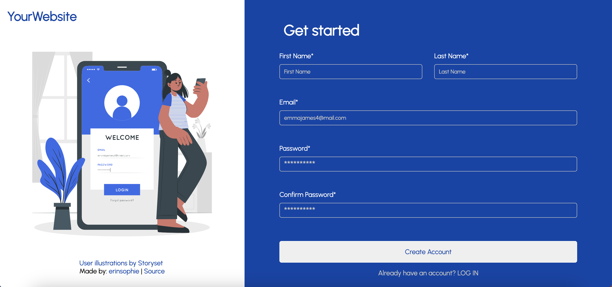

# Sign Up Form 

## [Live Demo](https://erinsophie.github.io/sign-up-form/)

# Technologies Used 

- HTML
- CSS
- Javascript

# Project goals

- The main goal of this project was to use client-side form validation to validate a basic registration form.

- Form Structure: The form uses the novalidate attribute to prevent the browser's default validation messages from appearing, and instead provides custom feedback with Javascript.

- Input Validation: JavaScript handles validation for each of the input fields. All inputs listens for blur events to provide feedback and also input events to trigger aggressive feeback when a field has already received input before.

- Password Validation: The password is checked against a regular expression to ensure it contains at least one uppercase letter, one number, one special character, and is at least 8 characters long.

- Email Validation: The email is checked using the built-in validity property of the input element, using the constraint validation API.

- Password Confirmation: The password confirmation field is checked to ensure it matches the entered password with live message feeback.

- Form Submission: When the form is submitted, a check is performed using the constraint validation API to see if all fields are valid. If they are not, the form prevents submission, and the invalid or empty input fields are highlighted with a red border.

